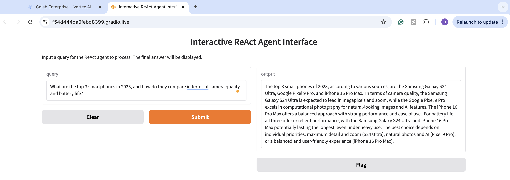

# ReAct Agent: Reasoning and Acting with Multiple Tools

`Author: Rishabh Srivastava`

This repository contains the code for an interactive ReAct Agent that integrates search, comparison, and analysis tools using LangChain, SerpAPI, and Google Vertex AI's Gemini model. The project includes a Gradio-based UI for processing queries and displaying results, with robust error handling and seamless tool transitions.

## Features
- **Search Tool**: Fetches information from the web using SerpAPI.
- **Comparison Tool**: Compares multiple items based on a specified category using LangChain.
- **Analysis Tool**: Summarizes and extracts key insights from search and comparison results using Vertex AI.

## Dependencies
To run this project, ensure the following Python libraries are installed:
- `gradio`
- `langchain`
- `langchain_community`
- `langchain_google_vertexai`
- `google-cloud-aiplatform`

Install the required dependencies using pip:
```bash
pip install gradio langchain langchain_community langchain_google_vertexai google-cloud-aiplatform
```

## Running the App
Run the application by using the command:
```bash
python app.py
```

You can access the Gradio interface via the provided link in your terminal.

The user interface generated by Gradio is shown below:
<figure>
    <figcaption><b>UI for ReAct Agent</b></figcaption>
    
</figure>

The Jupyter Notebook `ReAct_Agent.ipynb` has also been added for convenience in running the code and ease in experimentation.

